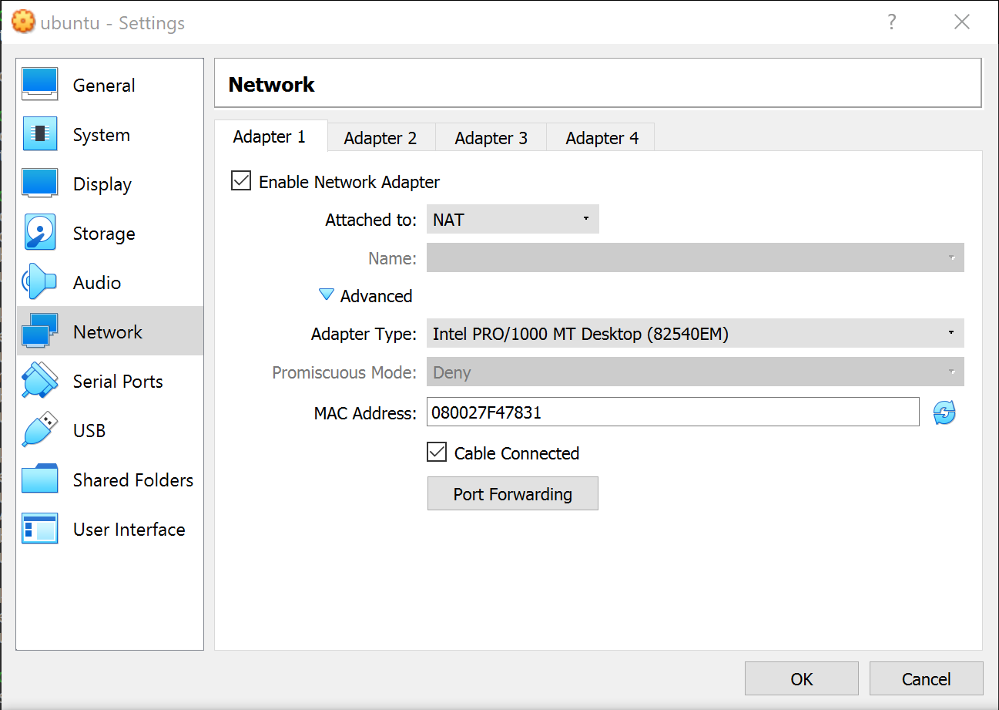
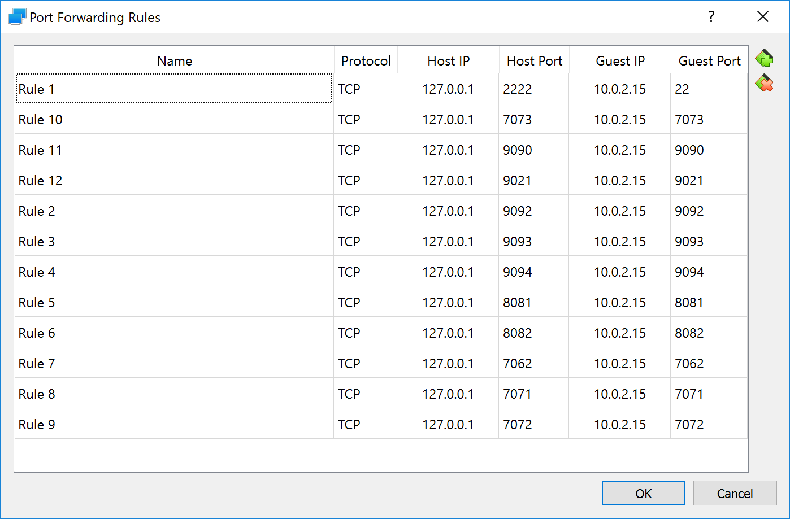

# Test Environment Scripts

This directory contains scripts for bringing up various services that are useful for
development / testing purposes:

1. Zookeeper [port: 2181, prometheus metrics port: 7062]
2. Kafka broker #1 [port 9092, prometheus metrics port: 7071]
3. Kafka broker #2 [port 9093, prometheus metrics port: 7072]
4. Kafka broker #3 [port 9094, prometheus metrics port: 7073]
5. Confluent Schema Registry #1 [port 8081]
6. Confluent Schema Registry #2 [port 8082]
7. Prometheus Server [port: 9090]

Build the docker images using `make_images.sh` (this will take some time).

Start the services using `services-up.sh <ip>`, where IP is the address that clients
should use to reach the services (typically 127.0.0.1).

Stop the services using `services-down.sh`.

## On Windows

Kafka does not run reliably under Windows (whether using the .bat scripts included in
the Kafka distribution, Linux subsystem for Windows or Docker for Windows). However, it's
possible to use these scripts inside a [Virtual Box](https://www.virtualbox.org/wiki/Downloads)
virtual machine and expose the services to the Windows host. To do this, you'll need to set up
port forwarding as below:

